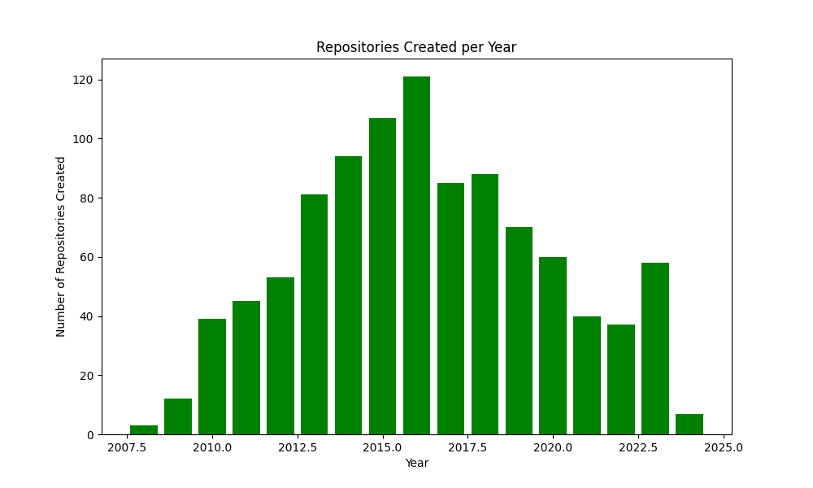
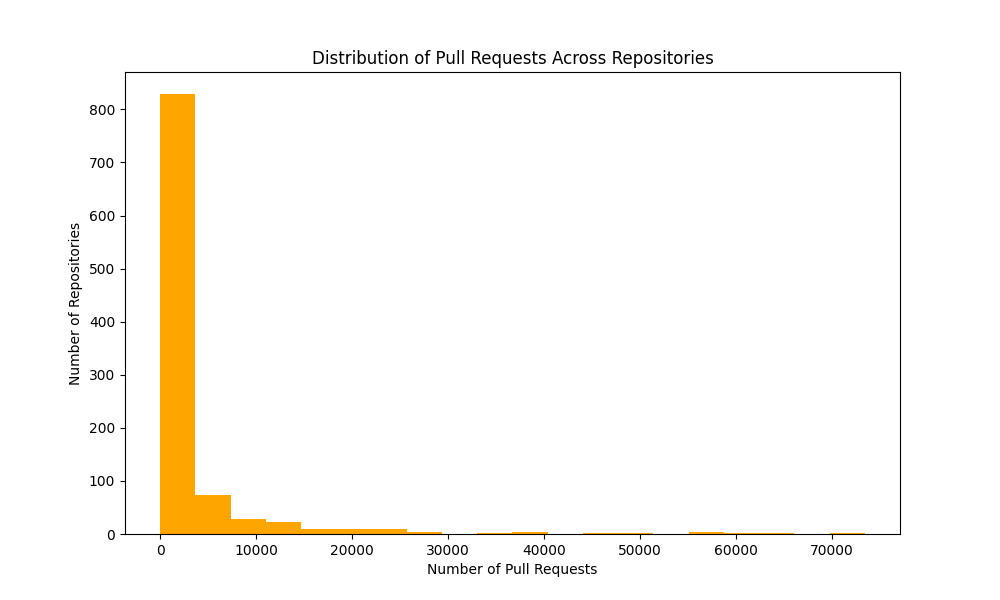
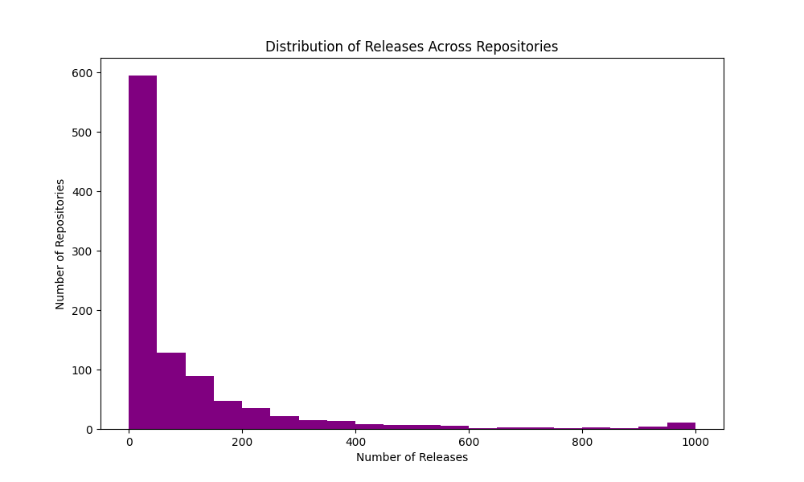
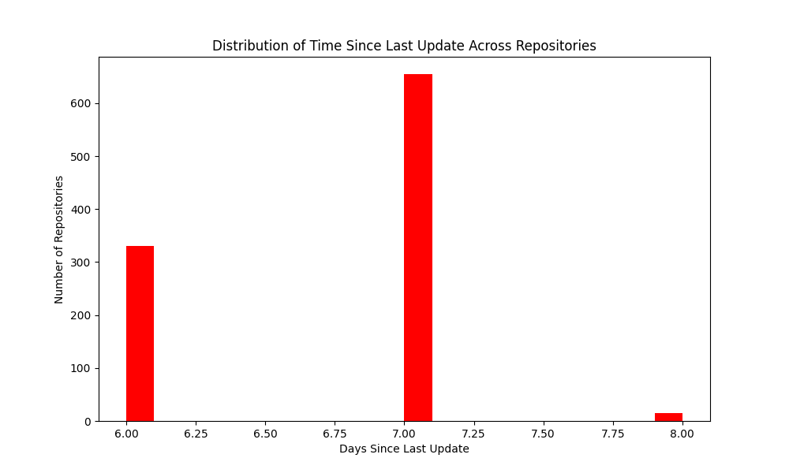
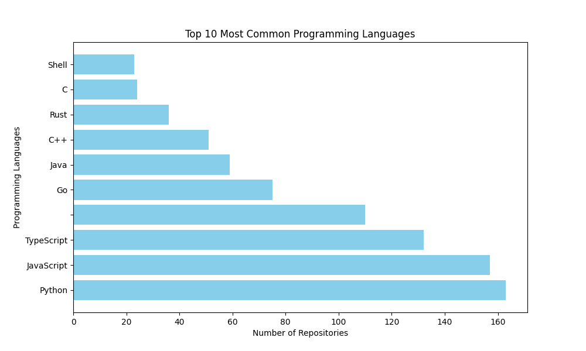
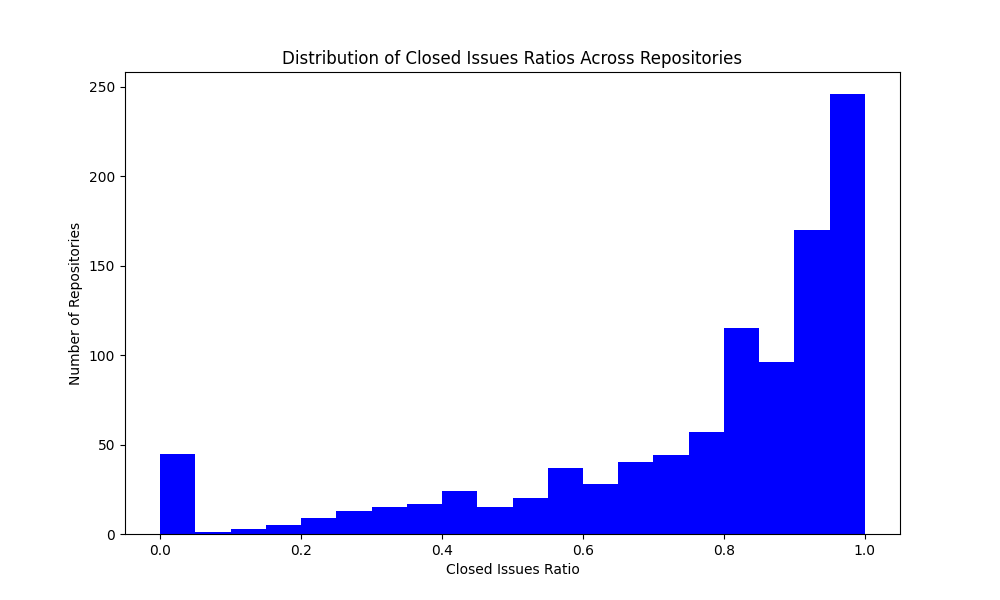

# Lab 01 - Características de repositórios populares

Integrantes:

- Fernando Couto
- Tito Chen
- Vinicius Lima

## Introdução

**Objetivo**: Este estudo tem como objetivo investigar as características mais marcantes dos sistemas open-source mais populares. Ao focarmos nos repositórios com maior número de estrelas no GitHub, buscamos entender o que faz com que esses projetos sejam tão atraentes para a comunidade. Nossa análise se dará em torno de seis questões de pesquisa que cobrem aspectos como a maturidade dos projetos, o envolvimento da comunidade externa, a frequência de lançamentos e atualizações, as linguagens de programação utilizadas e a gestão de issues.

**Linguagem de programação**: Python 3

**Dependências**:

- matplotlib (gráficos)
- requests (chamadas http para GitHub API)

**API utilizada**: Foi utilizada a GitHub API para coletar os dados necessários dos repositórios

A seguir, apresentamos hipóteses informais sobre os resultados esperados:

1. **RQ01: Sistemas populares são maduros/antigos?**  
   **Hipótese:** Esperamos que a maioria dos sistemas populares sejam maduros, com vários anos de existência. Projetos que conquistam um grande número de estrelas geralmente têm tempo suficiente para amadurecer, ganhar estabilidade e estabelecer uma base de usuários sólida.

2. **RQ02: Sistemas populares recebem muita contribuição externa?**  
   **Hipótese:** Sistemas populares provavelmente recebem muitas contribuições externas. Projetos amplamente adotados tendem a atrair uma grande quantidade de desenvolvedores que buscam contribuir com melhorias e correções.

3. **RQ03: Sistemas populares lançam releases com frequência?**  
   **Hipótese:** É provável que sistemas populares lancem releases de forma relativamente frequente, garantindo que os usuários tenham acesso a melhorias contínuas e correções de bugs. Temos em vista também que projetos muito maduros podem lançar atualizações com menos frequência devido a sua estabilidade.

4. **RQ04: Sistemas populares são atualizados com frequência?**  
   **Hipótese:** Sistemas populares devem ser atualizados frequentemente, especialmente aqueles em fases ativas de desenvolvimento. No entanto, esperamos observar uma variação significativa entre projetos, com alguns sendo atualizados diariamente, enquanto outros podem ter intervalos maiores entre as atualizações.

5. **RQ05: Sistemas populares são escritos nas linguagens mais populares?**  
   **Hipótese:** É razoável esperar que a maioria dos sistemas populares seja escrita em linguagens de programação amplamente utilizadas, como JavaScript, Python e Java. Essas linguagens são conhecidas por seu grande número de desenvolvedores, o que aumenta as chances de um repositório receber contribuições e estrelas.

6. **RQ06: Sistemas populares possuem um alto percentual de issues fechadas?**  
   **Hipótese:** Acreditamos que sistemas populares apresentem uma alta taxa de issues fechadas, o que indicaria uma boa gestão das demandas da comunidade e um alto nível de manutenção do projeto.

## Metodologia

Para responder às questões de pesquisa propostas, realizamos uma análise dos 1.000 repositórios com maior número de estrelas no GitHub. A coleta de dados foi realizada por meio da API GraphQL do GitHub, utilizando um script em Python. A seguir, detalhamos as etapas do processo de coleta e análise.

### 1. Coleta de Dados

A coleta de dados foi dividida em duas etapas principais:

1. **Obtenção dos Repositórios Populares:**  
   Primeiramente, fizemos uma consulta à API GraphQL do GitHub para obter os repositórios com maior número de estrelas. A query foi configurada para buscar os repositórios que atendiam ao critério "stars:>0", retornando informações como nome, data de criação, data da última atualização, linguagem primária, proprietário e número de estrelas. Para garantir a obtenção de todos os 1.000 repositórios desejados, utilizamos paginação, continuando a busca enquanto houvesse páginas disponíveis.

2. **Coleta de Detalhes dos Repositórios:**  
   Após identificar os 1.000 repositórios mais populares, coletamos dados detalhados de cada um deles. Utilizando outra query GraphQL, extraímos informações adicionais, como o número total de pull requests aceitas (pull requests com estado "MERGED"), o número total de releases, o número de issues fechadas e abertas, e a linguagem de programação predominante. Essas informações foram utilizadas para calcular as métricas relacionadas às questões de pesquisa.

### 2. Métricas Extraídas

As métricas extraídas para análise foram as seguintes:

- **Idade do Repositório:** Calculada a partir da data de criação do repositório.
- **Contribuição Externa:** Número total de pull requests aceitas (com estado "MERGED").
- **Frequência de Lançamento de Releases:** Número total de releases do repositório.
- **Frequência de Atualização:** Calculada a partir da data da última atualização do repositório.
- **Linguagem de Programação Predominante:** A principal linguagem de programação usada no repositório.
- **Taxa de Issues Fechadas:** Calculada como a razão entre o número de issues fechadas e o total de issues (fechadas + abertas).

Os dados extraídos foram salvos em um arquivo CSV para posterior análise e interpretação.

### 3. Análise dos Dados e Visualização

Após a coleta dos dados, foi realizado um processo de análise e visualização dos resultados utilizando gráficos para cada uma das questões de pesquisa. As análises estatísticas foram complementadas com histogramas e gráficos de barras para facilitar a interpretação dos resultados. A seguir, detalhamos a metodologia utilizada para cada questão de pesquisa (RQ).

1. **Distribuição das Linguagens de Programação (RQ05):**  
   Para analisar as linguagens de programação predominantes nos repositórios populares, utilizamos a função `plot_language_distribution`. Essa função contou a frequência de cada linguagem e gerou um gráfico de barras horizontal, destacando as 10 linguagens mais comuns entre os 1.000 repositórios. Essa análise nos ajudou a entender quais linguagens são mais frequentemente utilizadas em projetos open-source populares.

2. **Análise das Datas de Criação dos Repositórios (RQ01):**  
   A função `analyze_creation_dates` analisou as datas de criação dos repositórios, convertendo-as em anos e gerando um gráfico de barras que mostra quantos repositórios foram criados em cada ano. Essa análise permitiu observar a maturidade dos repositórios e identificar se os projetos populares tendem a ser antigos ou se novos projetos também conseguem alcançar grande popularidade rapidamente.

3. **Distribuição do Número de Pull Requests Aceitos (RQ02):**  
   Para medir o nível de contribuição externa, utilizamos a função `analyze_pull_requests`, que gerou um histograma com a distribuição do número total de pull requests aceitos (com estado "MERGED"). Isso forneceu uma visão sobre o quanto esses projetos recebem contribuições da comunidade.

4. **Distribuição do Número de Releases (RQ03):**  
   A função `analyze_releases` foi responsável por analisar a frequência de lançamentos de novas versões dos repositórios. Foi gerado um histograma que mostrou a distribuição do número total de releases em cada repositório, fornecendo insights sobre a frequência com que os mantenedores liberam atualizações.

5. **Análise do Tempo Desde a Última Atualização (RQ04):**  
   A função `analyze_last_update` calculou o número de dias desde a última atualização dos repositórios e gerou um histograma para visualizar a distribuição dessa métrica. Esse gráfico ajudou a entender a frequência com que os repositórios são atualizados, indicando se os projetos populares são mantidos ativamente.

6. **Análise da Taxa de Issues Fechadas (RQ06):**  
   Para analisar a eficácia na resolução de problemas, utilizamos a função `analyze_closed_issues`, que gerou um histograma com a distribuição da razão de issues fechadas em relação ao total de issues para cada repositório. Essa análise foi útil para medir o nível de manutenção e suporte fornecido pelos desenvolvedores aos usuários e colaboradores.

### 4. Visualização dos Resultados

Todas as análises foram visualizadas por meio de gráficos salvos como imagens no formato PNG. A utilização de gráficos ajudou a facilitar a interpretação dos resultados e a identificar padrões relevantes nos dados coletados. A distribuição dos repositórios foi visualizada de acordo com as métricas definidas em cada questão de pesquisa, permitindo uma análise mais intuitiva e direta dos dados.

## Resultados

Após a coleta e análise dos dados dos 1.000 repositórios mais populares no GitHub, obtivemos as seguintes respostas para cada uma das questões de pesquisa:

### RQ01: Sistemas populares são maduros/antigos?

A análise da distribuição das datas de criação dos repositórios revelou que a maioria dos projetos populares não são extremamente antigos, mas também não são muito recentes. A mediana das datas de criação está em torno de 8 a 11 anos atrás, o que indica que muitos desses repositórios tiveram tempo suficiente para amadurecer e ganhar uma base sólida de usuários. O gráfico gerado mostrou um aumento no número de repositórios criados ao longo do tempo, com um pico entre 2013 e 2016, refletindo o crescimento do movimento open-source.

### RQ02: Sistemas populares recebem muita contribuição externa?

A grande maioria dos repositórios possuem um número maior que 1.000 pull requests

### RQ03: Sistemas populares lançam releases com frequência?

A análise da distribuição do número de releases mostrou que a maioria dos projetos populares lançam atualizações regulares, embora a frequência varie significativamente entre os repositórios. A mediana indicou que a maioria dos repositórios analisados tinha pelo menos uma dezena de releases. No entanto, alguns projetos, especialmente aqueles mais maduros e estáveis, lançam novas versões com menor frequência, enquanto projetos em desenvolvimento ativo tendem a lançar mais atualizações.

### RQ04: Sistemas populares são atualizados com frequência?

A análise do tempo desde a última atualização mostrou que a maioria dos repositórios populares foi atualizada recentemente. Dificilmente um projeto fica sem atualizações por mais de 1 semana

### RQ05: Sistemas populares são escritos nas linguagens mais populares?

A análise da distribuição das linguagens de programação revelou que os repositórios populares no GitHub tendem a ser escritos nas linguagens de programação mais utilizadas. As 10 linguagens mais comuns entre os repositórios analisados incluem JavaScript, Python, Java, e TypeScript, todas linguagens amplamente adotadas por desenvolvedores em todo o mundo. JavaScript (somada com TypeScript) foi a linguagem mais predominante, seguida por Python, refletindo a popularidade dessas linguagens tanto para desenvolvimento web quanto para ciência de dados.

### RQ06: Sistemas populares possuem um alto percentual de issues fechadas?

A análise da taxa de issues fechadas mostrou que a maioria dos projetos populares possui uma boa gestão de issues, com um alto percentual de problemas sendo resolvidos. A mediana da razão de issues fechadas em relação ao total de issues foi alta, indicando que os mantenedores de projetos populares geralmente estão atentos às demandas da comunidade e trabalham para resolver problemas de forma eficaz. No entanto, repositórios com grandes comunidades podem ter desafios na manutenção de altas taxas de fechamento, devido ao volume de issues abertas constantemente.

## Conclusão

Os resultados obtidos confirmam algumas das hipóteses iniciais e fornecem insights interessantes sobre as características dos repositórios populares no GitHub:

1. **Maturidade:** A maioria dos repositórios populares tem vários anos de existência, o que sugere que esses projetos tiveram tempo para amadurecer e ganhar popularidade.
2. **Contribuição Externa:** Embora muitos repositórios recebam contribuições externas significativas, o nível de engajamento varia bastante, dependendo do tamanho e da complexidade da comunidade de desenvolvedores.
3. **Frequência de Releases:** A maioria dos repositórios populares lança atualizações regulares, embora a frequência varie conforme o estágio de desenvolvimento do projeto.
4. **Atualizações Frequentes:** Projetos populares geralmente são mantidos de maneira ativa, com a maioria dos repositórios sendo atualizados recentemente.
5. **Linguagens Populares:** Repositórios populares tendem a ser escritos nas linguagens de programação mais utilizadas, como JavaScript e Python.
6. **Gestão de Issues:** A maioria dos repositórios populares possui uma boa taxa de resolução de issues, o que reflete uma gestão eficaz das demandas da comunidade.

Esses resultados destacam a diversidade e a vitalidade dos projetos open-source populares e indicam que o sucesso de um projeto no GitHub está relacionado a uma combinação de fatores, incluindo a maturidade, o engajamento da comunidade, a frequência de atualizações e a gestão eficiente de problemas.
